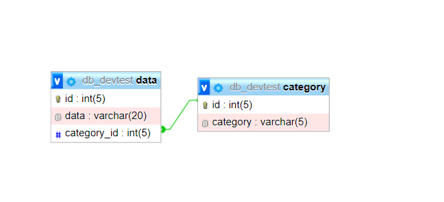
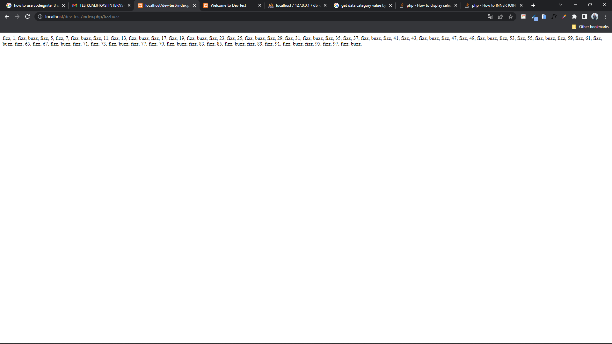
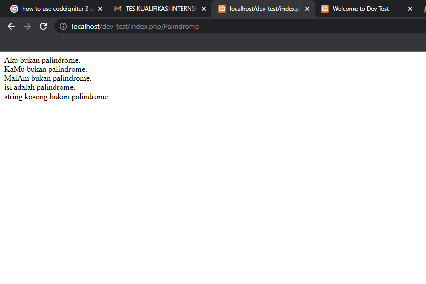
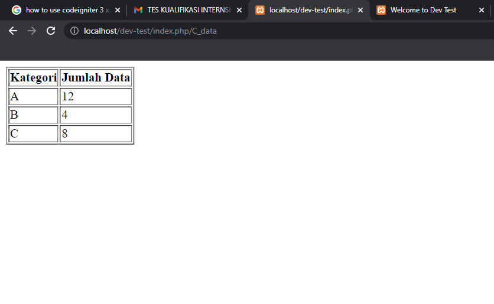

# Dev-test

### clone the repositories

```
git clone https://github.com/Arbyusman/dev-test.git
```

## Routes

This project is hosted using vercel

| Name         | Route                                        |
| ------------ | -------------------------------------------- |
| Test 1 | `http://localhost/dev-test/index.php/fizzbuzz` |
| Test 2 | `http://localhost/dev-test/index.php/Palindrome` |
| Test 3 | `http://localhost/dev-test/index.php/C_data` |


## ERD


### Test 1

Silahkan melakukan perulangan angka dari 1 - 100
jika angka tersebut merupakan kelipatan 2 , maka cetak nilai "Fizz"
jika angka tersebut merupakan kelipatan 3 , maka cetak nilai "Buzz"
jika angka bukan kelipatan 2 & 3, maka cetak angka tersebut


### Test 2

Palindrome adalah kondisi dimana sebuah kata akan sama walau dibaca dari depan dan belakang
Buatlah list kata seperti :
Aku, KaMu , MalAm , isi, 'string kosong'
Jika sebuah kata sama walau dibaca dari depan dan belakang, maka kata itu adalah palindrome,
Jika sebuah kata tidak sama dibcaca dari depan dan belakang, maka kata itu bukan palindrome,
Jika sebuah kata adalah string kosong , maka bukan palindrome


### Test 3

MVC:

1. Buat sebuah database : db_devtest
2. Buatlah tabel yang menampung kategori (A,B,C) | dengan kolom {id, category}
3. Buatlah tabel yang menampung data | dengan kolom {id, data, category_id}
4. Tampilkan rekap data seperti berikut :

| Kategori | Jumlah Data |
| -------- | ----------- |
| A        | 12          |
| B        | 4           |
| C        | 8           |


